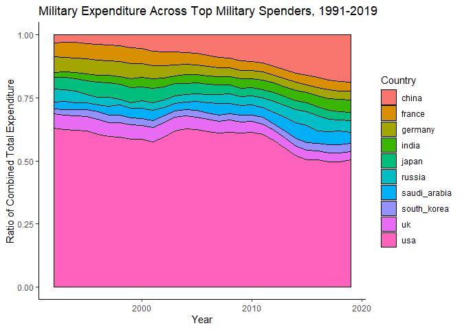

---
# <b>Working Papers</b> 

["Measuring Economic Activity in the Presence of Superstar MNEs"](https://www.researchgate.net/publication/357001079_Measuring_Economic_Activity_in_the_Presence_of_Superstar_MNEs) with Philip Economides.

<b>Abstract:</b> 
In 2015, changes to Irish tax legislation, known as the "2015 Finance Act", coincided with a 25 percent annual increase in real gross domestic product. 
We provide evidence confirming the convictions of existing literature that the presence of large multinational enterprises (MNEs) is likely to have ``distorted" Irish GDP, a measure previously considered to be a reliable proxy of domestic economic activity. 
Furthermore, we provide an alternative method of statistically isolating the variation in GDP growth attributable solely to domestic activity growth to infer the prevailing state of the Irish economy.
Our findings imply a 21% lower level of GDP relative to the official measure recorded for 2020. 
We suggest that our methodology may be applied by policymakers in small open economies to improve the accuracy of growth and business cycle monitoring.

---
# <b>Works in Progress</b>

"Evolution of Community Bank Profitability Conditions."

"Arms Races and International Business Cycles".

"The Effect of Sleep Loss on Productivity" with Andrew Dickinson and Philip Economides.

---
# <b>Publications</b>

["Using deep learning to examine the correlation between transportation planning and perceived safety of the built environment"](https://journals.sagepub.com/doi/abs/10.1177/2399808320959079) with Justin Hollander, Alphonsus Adu-Bredu, Minyu Situ, and Shabnam Bista, Environment and Planning B: Urban Analytics and City Science, 2020.

---
# <b>Software</b>

### <b>DynamicFactorModeling.jl</b>

[DynamicFactorModeling.jl](https://github.com/gionikola/DynamicFactorModeling.jl) is a Julia package I'm currently creating that allows users to simulate, estimate, and forecast using multi-level dynamic factor models.
My focus at the moment is on Bayesian estimators, as they allow for inference on the latent factors, although I plan on including classical estimators in the future.

---
# <b>Other</b>

### <b>Library of Statistical Techniques (LOST)</b>

[LOST](https://lost-stats.github.io/) is an open source website with the goal of making it easy to execute statistical techniques in statistical software.
I am an author of multiple pages, and have written the Julia sections of others across time series methods. 
